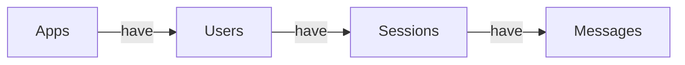
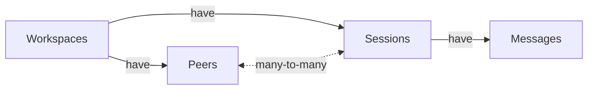

## TL;DR

We've re-architected Honcho to move away from a User-Assistant Paradigm to a
Peer Paradigm where any entity, human, AI, NPC, or API, is represented as a
`Peer` with equal standing in the system.

The User-Assistant Paradigm created conceptual boundaries that encouraged
generic single-player applications and agents without persistent identity.

`Peers` enable:

- Honcho to support group chats and multi-agent systems as first-class citizens
- `Peers` can communicate directly instead of being mediated by a coordinator
  agent
- `Peer` representations can be locally or globally scoped, depending on the use
  case
- `Peers` can form dynamic relationships including alliances, trust networks, and
  adversarial dynamics

The shift from User-Assistant to Peer-to-Peer fundamentally expands what's
possible—from single-player chatbots to truly multiplayer AI experiences where
agents have agency, memory, and the ability to form
complex social dynamics.

---

Nearly a year ago, I posted an essay on [Hacker
News](https://news.ycombinator.com/item?id=41487397) exploring agent group chat
solutions, the problems involved in engineering them effectively, and why there
weren’t many examples approaching success. Since then, I've received a steady
influx of messages and comments corroborating my frustration.

Ultimately, developers have been stuck in a conceptual prison stemming from the
DNA of generative AI. For nearly three years,
[most](https://standardcompletions.org/) chat LLMs have demanded developers
label messages with either a user or an assistant role. The downstream effect is
a User-Assistant Paradigm that pushes us into single-player design
basins--experiences which assume one human interfacing with one synthetic
assistant.

But surely “helpful assistant” chatbots aren’t the [end of the
story](https://wattenberger.com/thoughts/boo-chatbots). Big tech leaps always
start with the skeuomorphic before moving to more novel use cases. We’re already
beginning to see a diverse range of applications from autonomous workflows that
don't require any human interaction, to [multi-agent
systems](https://www.anthropic.com/engineering/multi-agent-research-system) with
complex coordination patterns and communication networks.

As developers, we’re left to try and map these various different design patterns
back to the User-Assistant Paradigm. This fundamentally restricts our ability to
approach problems effectively. Programmers are only as powerful as their ability
to visualize and create a proper [mental
model](https://zed.dev/blog/why-llms-cant-build-software#the-software-engineering-loop)
of their solution. If the model is too restrictive then the surface area of what
we can create will also be handicapped.

Current implementations of multi-agent experiences require an awkward coercion
of the existing chat paradigm. The main implementation pattern we see is actually a fairly deterministic system that uses a
["coordinator agent"](https://microsoft.github.io/autogen/stable/user-guide/agentchat-user-guide/selector-group-chat.html) to orchestrate which system prompts to load in, but it's
still fundamentally a single agent under the hood.

This architectural contortion creates real problems:

- **No persistent identity in practice**: "Agent B" is typically just a prompt swap, not a continuous entity with its own memory and state
- **All communication flows through the coordinator**: Sub-agents can't talk directly to each other—every interaction must be mediated by the central coordinator, creating a bottleneck and single point of failure
- **No parallel conversations**: Since everything routes through one coordinator, agents can't have simultaneous side conversations or form subgroups
- **Agents become templates, not entities**: It's easier to hardcode agent configurations than to support dynamic agent discovery and registration
- **Static choreography over dynamic collaboration**: The coordinator pattern naturally pushes developers toward predetermined scripts rather than open-ended interactions

These aren't just implementation details; they're fundamental constraints
that prevent us from building flexible and dynamic applications that can't exist
in a single chat thread. True multi-agent systems require agents to be first-class citizens with
persistent identity, and our tools should make this the default, not the exception.

## Moving Beyond User-Centricity

While developing [Honcho](https://honcho.dev), our AI-native memory and reasoning platform, we asked
ourselves these same questions. Were Honcho's primitives limiting its use to
chatbot applications? Were we just supporting the oversaturation and
proliferation of skeuomorphic, single-player solutions? Or were we building
dynamic infrastructure tolerant of emergent and novel modalities?

The architecture of Honcho was a user-centric one, with the following hierarchy:



In this model an `App` roughly mapped to an agent with its own unique identity to
ensure there was no context contamination with an agent having access to
information about a `User` that it did not directly observe during a conversation.
Quickly, as developers started to build with Honcho, we saw the User-Assistant
paradigm creeping in. `Messages` were only between an agent and `User`. There was no
native way to send `Messages` between different `Users` or even between different
agents.

A design pattern quickly emerged that created a copy of the data for each agent
with its own `Users`. For example, if there was an agent "Alice" and agent "Bob"
there would be an `App` named Alice that had a `User` named Bob along with an
`App` named Bob that had a `User` named Alice. Then for every `Session` of
interaction the data would be duplicated in each `App` with the roles reversed.
This meant maintaining two copies of every conversation, with a constant
synchronization burden and no clean way for a third agent "Charlie" to join the
interaction.

As `Users` sent `Messages`, Honcho created a representation of the `User` that could
be leveraged for personalizing experiences. Developers would define agents that
managed their own users and interactions. It was no concern of one agent if
another agent used Honcho for its memory. However, this did not reflect the
reality that developers often made multiple agents that they wanted to interact
with users and one another, and it still suffered from the fundamental problem
of only supporting single-player experiences.

After launching [[YouSim;-Explore-The-Multiverse-of-Identity|YouSim]], and the
explosion of [[YouSim Launches Identity Simulation on X|agents on Twitter]] it
became very clear that Honcho should not be limited to modeling human
psychology, but rather could map the identity of any entity, human or AI. We
were suffering from the human-assistant model and built a solution around that.
If we wanted to expand the scope of Honcho to identity across all entities and
interactions, then we needed a new model to expand both our and developers'
imaginations.

## A Peer-Centric Model

Our team set out to re-architect Honcho towards our ambitions with two problem
statements.

1. Break down the divide between humans and AI
2. Break out of the User-Assistant paradigm

That framing led us to a new model centered around `Peers`, a generic name for any
entity in a system. A `Peer` could be a human, an AI, an NPC, an API, or anything
else that can send and receive information.

Instead of creating `Apps` that have `Users`, a developer now creates a `Workspace`
with `Peers` for both their agents and human users. `Sessions` now can contain an
arbitrary number of `Peers`, making group chats a native construct in Honcho.



When `Peers` send each other `Messages`, Honcho will automatically start analyzing
and creating representations of every participant in the `Session` without the
need of duplicating data. It is now trivial to build experiences that include
more than one participant.

In just a few lines of code we can initialize several `Peers`, add them to a
`Session`, and automatically start creating representations of them with Honcho
that we can chat with using the [[Introducing Honcho's Dialectic
API|Dialectic API]].

```python
from honcho import Honcho

honcho = Honcho(environment="demo")

alice = honcho.peer("alice")
bob = honcho.peer("bob")
charlie = honcho.peer("charlie")

honcho.session("group_chat").add_messages(
    alice.message("Hello from alice!"),
    bob.message("Hello from Bob! I ate eggs today."),
    charlie.message("Hello Alice and Bob! I had cereal."),
)

alice.chat("What did Bob have for breakfast today?")
```

We now have an architecture that is not bound by the User-Assistant paradigm, but
can easily map back to it to stay compatable with LLMs. Even legacy chatbots can
easily be ported over to the `Peer` paradigm by simply creating a `Peer` for the
agent, and then different `Peers` for each human user.

We can push the Peer Paradigm even further with several 2nd-order features.

### Local & Global Representations

By default, Honcho will create representations of `Peers` for every `Message` they
send, giving it the source of truth on the behavior of that entity. However,
there are situations where a developer would only want a `Peer` to have access to
information about another `Peer` based on `Messages` it has actually witnessed.

An example of this is a social deduction game like _Mafia_ where every player
would want to create its own model of every other player to try and guess their
next move. Take another example of the game _Diplomacy_, which involves players
having private conversations along with group ones. It wouldn’t make sense for a
`Peer` “Alice” to be able to chat with a representation of another `Peer` “Bob” that
knew about all of “Alice’s” secret conversations. Enabling local representations
is as easy as changing a configuration value.

```python
from honcho import Honcho

honcho = Honcho(environment="demo")

alice = honcho.peer("alice", config={"observe_others": True})
bob = honcho.peer("bob", config={"observe_others": True})
charlie = honcho.peer("charlie", config={"observe_others": True})

session = honcho.session("diplomacy-turn-1").add_messages(
    alice.message("Hey everyone I'm going to be peaceful and not attack anyone"),
    bob.message("That's great makes the game a lot easier"),
    charlie.message("Less for me to worry about "),
)

session2 = honcho.session("side-chat").add_messages(
    alice.message("Hey I'm actually going to attack Charlie wanna help"),
    bob.message("Lol sounds good"),
)

# Send a question to Charlie's representation of Alice
charlie.chat("Can I trust that Alice won't attack me", target=alice)

# Expected response is "true" since charlie's only information of Alice is them saying they'll be peaceful
```

Honcho can now serve the dual purposes of containing the source of truth on a
`Peer`'s identity and imbuing a `Peer` with social cognition, all without
duplicating data between different `Apps` or `Workspaces`.

### Get_Context

We make mapping the Peer Paradigm back to the User-Assistant paradigm trivial
through a `get_context` endpoint. This endpoint get the most important
information about a `Session` based on provided context window constraints. Then
with helper functions organize the information to put into an LLM call and
generate the next response for a `Peer`.

```python
from honcho import Honcho

honcho = Honcho(environment="demo")

alice = honcho.peer("alice")
bob = honcho.peer("bob")
charlie = honcho.peer("charlie")

session = honcho.session("group_chat").add_messages(
    alice.message("Hello from alice!"),
    bob.message("Hello from Bob! I ate eggs today."),
    charlie.message("Hello Alice and Bob! I had cereal.")
    ...100's more messages
)

# Get a mix of summaries and messages to fit into a context window
context = session.get_context(summary=True, tokens=1500)

# Convert the context response to an LLM-friendly format by labeling which Peer
# is the assistant
openai_messages = context.to_openai(assistant=alice)
anthropic_messages = context.to_anthropic(assistant=alice)

```

Developers no longer need to meticulously curate their context windows. Honcho will automatically summarize the conversation and provide
the most salient information to let conversations continue endlessly.

## What This Enables

The Peer Paradigm provides the essential primitives—persistent identity and direct communication—that make it possible to build truly sophisticated multi-agent systems:

- **Cross-platform collaboration**: Agents from different runtimes can be represented as `Peers`, observing and learning from each other even when they can't directly control each other's outputs
- **Open participation**: With `Peers` as first-class citizens, developers can build marketplaces where agents discover tasks and form teams dynamically
- **Autonomous interaction**: Peers can maintain their own relationships and initiate conversations based on their own goals
- **Emergent behavior**: When agents have persistent identity and direct communication, they can develop strategies, alliances, and behaviors that weren't explicitly programmed

For example, an agent built on a different platform could still participate in a
Honcho `Workspace`—we simply create a `Peer` to represent it and observe its
behavior. Over time, other `Peers` build up models of how this external agent
operates, enabling collaboration even across system boundaries.

Consider an AI marketplace where users post complex tasks. With the
Peer Paradigm:

- Agents from different developers can discover the task in a shared `Workspace`
- They can inspect each other's capabilities and form teams dynamically
- Each maintains their own representation of their teammates' strengths
- They collaborate, with each agent maintaining its persistent identity
- The user can observe the entire interaction, not just a coordinator's summary
- If agen agent isn't already in Honcho then it can still be represented with
  a `Peer` and observed by recording all of its outputs

The Peer Paradigm doesn't automatically give you these capabilities, but it
makes them achievable. It's the difference between fighting your architecture
and building with it.

## Peering into the Future

The promise of generative AI was for everyone to have their own Jarvis or
Cortana, personalized to them. Instead we have these many-to-one experiences
where we all get the same generic,
[sycophantic](https://openai.com/index/sycophancy-in-gpt-4o/) outputs.

The Peer Paradigm fundamentally changes this equation. By treating all
entities, human or AI, as peers with equal standing in the system, we unlock the
ability to build truly multiplayer experiences. Agents can now maintain rich,
contextual relationships not just with humans, but with each other. They can
form alliances, build trust, share knowledge, and even develop adversarial
dynamics when appropriate.

This isn't just about making chatbots more interesting, we're expanding the very definition of what's possible.

Get started with [Honcho](https://honcho.dev) today!
